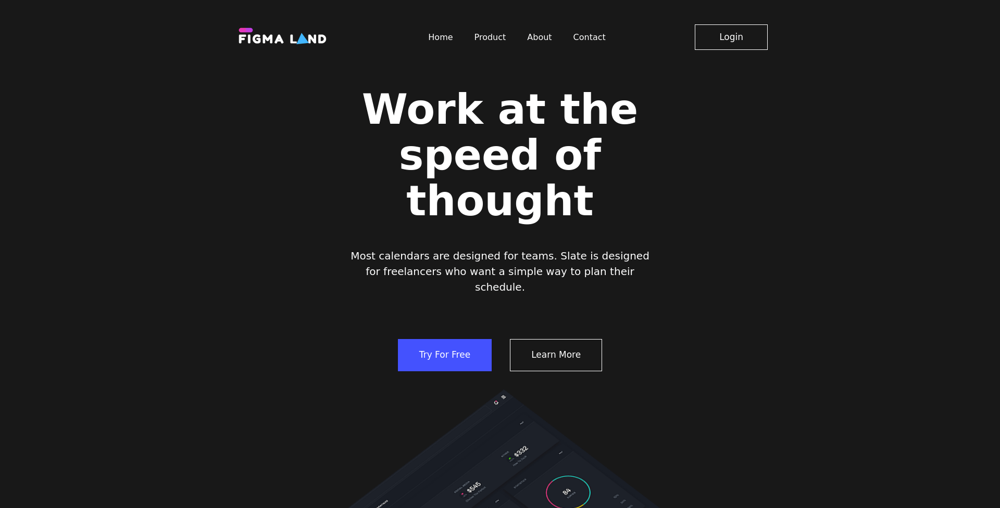

# Figma-Land — Адаптивный лендинг на HTML + SCSS с БЭМ


Простой, чисто свёрстанный лендинг, созданный по макету из Figma. Проект выполнен с соблюдением современных веб-стандартов и методологии **БЭМ**.

👉 [Посмотреть онлайн (GitHub Pages)](https://zheny179.github.io/Figma-Land/) 

---

## 📸 Скриншот




---

## 🛠️ Технологии
- **HTML5** — семантическая вёрстка
- **SCSS (Sass)** — препроцессор для удобного написания стилей
- **БЭМ** — методология для именования классов и структурирования кода
- **Адаптивная вёрстка** — поддержка мобильных, планшетов и десктопов

---

## 🚀 Как запустить локально
1.  Склонируй репозиторий:
    ```bash
    git clone https://github.com/Zheny179/Figma-Land.git
    ```
3.  Перейти в папку Figma-Land
4.  Открыть файл *index.html* в браузере
